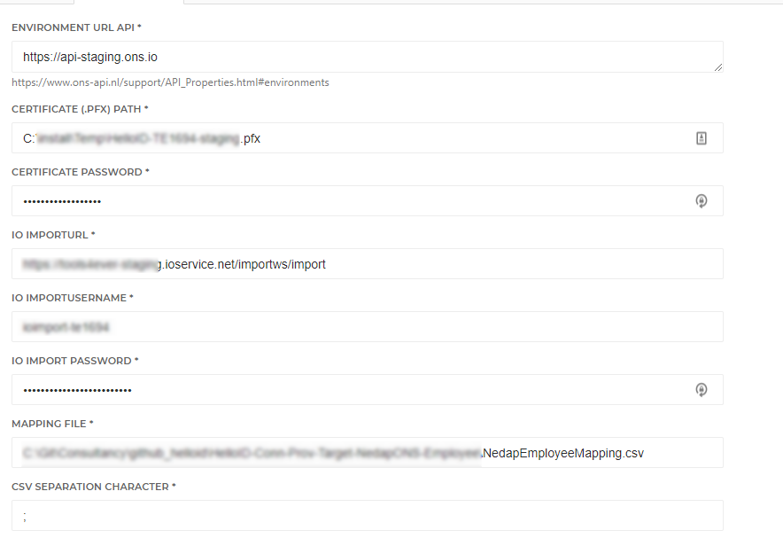

# HelloID-Conn-Prov-Target-NedapONS-Employee-Readme

| :information_source: Information |
|:---------------------------|
| This repository contains the connector and configuration code only. The implementer is responsible to acquire the connection details such as username, password, certificate, etc. You might even need to sign a contract or agreement with the supplier before implementing this connector. Please contact the client's application manager to coordinate the connector requirements.       |

<br />

> :warning: **_Information_**   <br />This connector has limited support for Nedap employees. Please check the [Fact Sheet](#Fact-Sheet) for more details.
<br />Extensive knowledge of HelloID provisioning and Nedap Ons (Nedap user and Nedap employee) are required.

<br />
<br />

<p align="center">
  
</p>


<!-- TABLE OF CONTENTS -->
## Table of Contents
* [Introduction](#introduction)
* [Getting Started](#getting-started)
  * [Connection Settings](#Connection-Settings)
  * [Prerequisites](#Prerequisites)
  * [Remarks](#Remarks)
* [Provisioning](#provisioning)
  * [Employee Additional Mapping](#Employee-Additional-Mapping)
  * [Supported Properties](#Supported-Properties)
* [Fact Sheet](#Fact-Sheet)
  * [Remote Nedap documentatie](#Remote-Nedap-documentatie)
* [Setup the connector](Setup-The-Connector)
* [HelloID Docs](#helloid-docs)
* [Forum Thread](#forum-thread)


## Introduction
This Repository does only contains the readme. The source code can be found in a private Repository and is meant only for internal use. Link to Repository: [Nedap Ons Employee](https://github.com/Tools4everBV/HelloID-Conn-Prov-Target-NedapONS-Employee)

Nedap Ons provides an API and XML import method to programmatically interact with its services and data. This connector has limited support for managing employees in Nedap. It does not support (employee nor client) scheduling or other none Identity and Access management functionality. It can create multiple employees accounts in Nedap for each employment (EmployeeId and Employment sequence number combination).


<!-- GETTING STARTED -->
## Getting Started

### Connection Settings

The following settings are required to connect to the API.

| Setting     | Description |
| ------------ | ----------- |
| Environment URL API     |    https://api-staging.ons.io                                     |
| Certificate (.PFX) Path    |  <Fullpath to Certificate> Nedap-cert.pfx                       |
| Certificate Password |    Password of the certificate                                       |
| IO Import Url | The Url of the XML import of Nedap, Example: https://<.ioservice.net/importws/import"   |
| IO Import Username |   The username of the IO Import         |
| IO Import Password|   The Password of the IO Import          |
| mappingFilePath| The Path to the mapping file   |
| CSV separation Character| Mapping File CSV Separation Character         |

------------------

### Prerequisites
- A valid Nedap certificate (.PFX) *Tools4ever need to requests a certificate by Nedap to access the REST API*
- Credentials for the IO Import *Different account credentials as the REST API*
- Mapping between HR departments/functions to Cluster/ Education/ registrationProfile
- A custom property on the HelloID Person contract with a combination of the employeeCode and EmploymentCode named: [custom.NedapOnsIdentificationNo]
Example:
  ```javascript
  function getValue() {
      return sourceContract.PersonCode + "-" + sourceContract.EmploymentCode
  }
  getValue();
  ```


### Remarks
- This connector only supports a limited Employee object. When the required functionality is outside scope of this limited Employee connector, you will need an external supplier to configure a direct connection between your HRM system and Nedap Employees. It this situation, we can still manage your Ons user accounts and permissions.
 - Since the connector supports multiple accounts per a single HelloID person. The default Primary contract calculation is not always applicable. The connector contains an example of a "Primary contract calculation" , that calculates the primary contract for each employment (Nedap Account).
 - You can use this connector in combination with the Nedap-Users connector. When you use them both in the same environment. You must add the Employee Target system as "Use account data from system". To make sure the employee object exists in Nedap before starting to create the account object.
- The connector is built containing three properties which cannot be mapped directly from the person model in HelloID. So there is a mapping file needed. This file must include a mapping between HR departments and/or function to a Nedap cluster, education and registration profile. The actions of the connector fails, when there is no mapping found. Of course, this can be changed in the code. But is not configurable by default.
- When updating an employee account, you cannot verify if a property is successfully updated in Nedap. To do this you must check the Import Rapportage from the Nedap UI. *Beheer > Import > Importrapportage inzien*

-----------
## Provisioning
Using this connector you will have the ability to create and manage the following items in Nedap:

Create:
* Multiple employee objects for each Employement (employeeId + SequenceNumber), based on the contracts in condition from the Business Rules

Update:
* Update attributes of the corresponding employee account as configured in the connector mapping. An example of such mapping file can be found in the Assets folder.
* Create new employee account for each Employement (employeeId + SequenceNumber) combination.
* Disable account reference from Aref  -*See delete action* -

Delete:
*  Set an end date of the contract for each employee account. So the user is unable to log in.

----------

###  Employee Additional Mapping:
| Header    | Description |
| ------------ | ----------- |
|Primary Contract Calcuatlion| Example of a Primary contract calculation.
| Title.ExternalId   | Property of the HelloID primary contract per employment
| Department.ExternalId  | Property of the HelloID primary contract per employment
| EducationId   |   Deskundigheidsprofiel > Import Code
| RegistrationProfile | Weekkaartprofiel > ProfileName
| ClusterId  | Organigram > Identificatie
| ClusterName  |    Organigram > Naam

*Please note! That the mapped value will be created if they do not exist in Nedap! So if you choose in a RegistrationProfile that does not exist, it will be created. What might encounter some unexpected behavior.*

### Supported Properties
| PropertyName | Notes |
| ------------ | ------------|
| Id | IdentificationNo |
| Firstname |  |
| Birthname |  |
| Lastname |  |
| DateOfBirth |  |
| EmailAddress |  |
| Gender |  |
| Initials |  |
| NameUsage |  |
| AuthenticationNumber | Is needed for second  factor |
| Education | Deskundigheidsprofiel => Import Code  |
| RegistrationProfile | Weekkaartprofiel => ProfileName |
| Cluster | Organigram > Identificatie (Team) |
| Contract | Only a single Employment. With start and endate.|
___________

## Fact Sheet
The following table displays an overview of the functionality for the Nedap Ons connector for HelloID Provisioning and Service Automation.

|Type of action| Nedap    | HelloID provisioning |HelloID Service Automation|
| ------------ | ----------- |----------- |----------- |
| Create Employees |Yes|Yes, *Simple employee, no scheduling* |No
|Update Employees  |Yes|Yes, *Simple employee, no scheduling* |No
|Delete Employee |No|No, *Sets an enddate on contract* |No
|Manage Employee Contracts|Yes|Yes 1 contract, *Simple employee, no scheduling* |No
| Set RegestrationProfiel (Weekkaart) |Yes|Yes, *Additional mapping required*|No
|Set Cluster (Team)|Yes|Yes, *Additional mapping required*|No
|Set education (Deskundigheidsprofiel )|Yes|Yes, *Additional mapping required*|No
|Set Discipline |Yes|No|No
|Set Profession (Beroepsgroep) |Yes|No|No
|VacationRight|Yes|No, *outside the scope of identity management.*|No
|AccountAmount|Yes|No, *outside the scope of identity management.*|No
|VacationAmounts|Yes|No, *outside the scope of identity management.*|No
|CompensationAmount (compensatiesaldo)|Yes|No, *outside the scope of identity management.*|No
|CompensationSetting (compensatieberekening instellingen)|Yes|No, *outside the scope of identity management.*|No
|HourlyWages|Yes|No, *outside the scope of identity management.*|No
|CollectiveAgreement|Yes|No, *outside the scope of identity management.*|No
|Addresses|Yes|No, *outside the scope of identity management.*|No
|FreeField|Yes|No|No
-------------


### Remote Nedap documentatie
* Nedap API documentatie → [klik](https://www.ons-api.nl/APIS.html)
 * Nedap XML import handleiding → [klik](https://support.nedap-healthcare.com/topic/gegevens-importeren-in-ons-via-xml-bestanden#te-importeren-gegevens-en-schema-definitie-(xsd))
* Nedap XML import documentatie → [klik](https://support.nedap-healthcare.com/images/technische_documenten/io_server_xml_interface.pdf)
* Nedap ONS autorisatie handleiding → [klik](https://ons-api.nl/support/Shield.html)

## Setup the connector

Before using this connector, make sure you replace the variables below. So they meet your configuration:
 


_For more information about our HelloID PowerShell connectors, please refer to our general [Documentation](https://docs.helloid.com/hc/en-us/articles/360012558020-How-to-configure-a-custom-PowerShell-target-connector) page_


## HelloID Docs
The official HelloID documentation can be found at: https://docs.helloid.com/

## Forum Thread
The Forum thread for any questions or remarks regarding this connector can be found at: [Helloid-prov-target-nedap-ons-employee](https://forum.helloid.com/forum/helloid-connectors/provisioning/312-helloid-prov-target-nedap-ons-employee)
